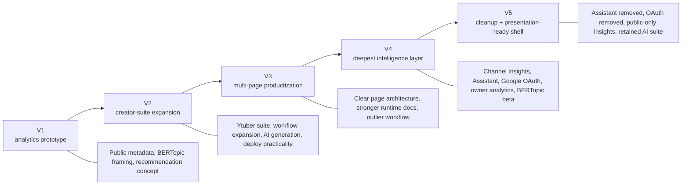
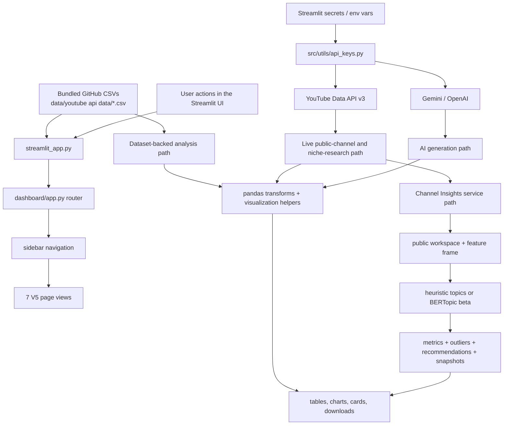
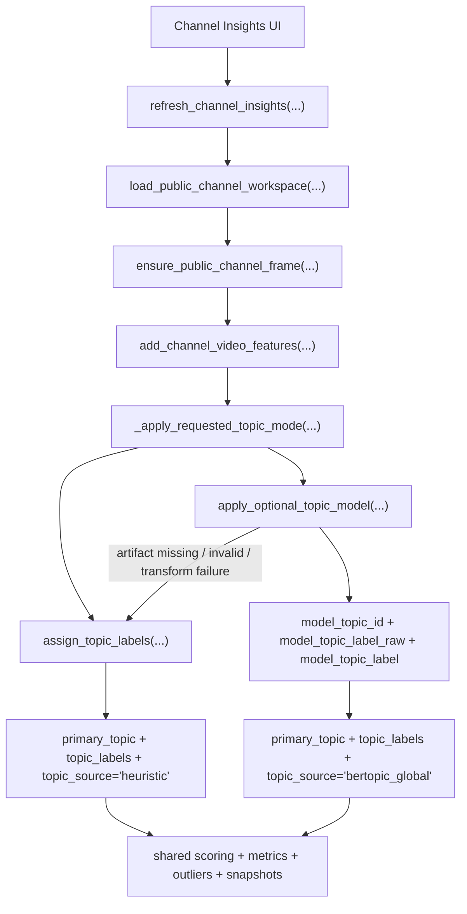

# YouTube IP V5

YouTube IP V5 is the presentation-ready, Streamlit-deployable version of a five-version YouTube creator intelligence project. It brings together everything the team learned from V1 through V4, keeps the parts that proved most useful in deployment, and documents the experiments, removals, and tradeoffs that shaped the current product.

Live app:

- [youtube-ip-v5.streamlit.app](https://youtube-ip-v5.streamlit.app/)

## At A Glance

| Metric | Value |
| --- | --- |
| Deployed versions documented here | `5` |
| Live Streamlit app links | `5` |
| Current V5 sidebar destinations | `7` |
| Current primary data paths | `2` |
| Current Channel Insights topic modes | `2` |
| Current live provider families | `3` (`YouTube`, `Gemini`, `OpenAI`) |
| Optional model-artifact path | `1` (`BERTopic` beta) |

## Why This Project Exists

The original goal of the project was simple: help small-to-mid-sized YouTube creators make better content decisions with better intelligence than YouTube Studio alone provides. The early versions focused on public metadata, cross-channel benchmarking, semantic topic modeling, and AI-assisted recommendations so the team could answer questions like:

- What content themes actually perform across comparable channels?
- Which topics, formats, and publishing patterns correlate with stronger performance?
- How can a creator move from raw channel data to a usable action plan for titles, thumbnails, and next videos?

That core question stayed constant across every version. What changed was the way the app packaged the answer.

## The Five-Version Story



## Deployed Version History

| Version | Live App | Main Goal | Headline Additions | Major Simplifications / Later Changes | Status |
| --- | --- | --- | --- | --- | --- |
| `V1` | [youtube-stats-ip.streamlit.app](https://youtube-stats-ip.streamlit.app/) | prove the analytics + recommendation concept | public YouTube analytics framing, BERTopic modeling direction, initial Streamlit dashboard, thumbnail dashboard | later versions expanded beyond the original compact dashboard | historical prototype |
| `V2` | [youtube-stats-ip-v2.streamlit.app](https://youtube-stats-ip-v2.streamlit.app/) | expand into a creator operating system | creator workflow framing, richer app shell, advanced Ytuber suite, deploy guidance | some modules were later split, simplified, or removed for maintainability | historical expansion |
| `V3` | [youtube-ip-v3.streamlit.app](https://youtube-ip-v3.streamlit.app/) | turn the project into a clearer product | five-page product shell, strong runtime architecture, outlier workflow, better repo map | later versions added deeper insights and then simplified again | historical productization |
| `V4` | [youtube-ip-v4.streamlit.app](https://youtube-ip-v4.streamlit.app/) | deepen intelligence and tracked-channel analysis | Channel Insights, sidebar Assistant, Google OAuth owner analytics, optional BERTopic beta | V5 removed the Assistant and Google OAuth to reduce deployment complexity | historical deep-intelligence release |
| `V5` | [youtube-ip-v5.streamlit.app](https://youtube-ip-v5.streamlit.app/) | keep the best parts and document the journey | public-only Channel Insights, retained AI suite pages, Thumbnails rename, consolidated docs, optional BERTopic beta | lighter than V4, easier to reason about, presentation-ready documentation | current release |

## What Changed Across Versions

| Area | V1 | V2 | V3 | V4 | V5 |
| --- | --- | --- | --- | --- | --- |
| Core problem | creator strategy from public data | same | same | same | same |
| Bundled dataset benchmarking | present | present | strong | present | present |
| Creator workspace | early | expanded heavily | strong | present | present |
| Outlier research | emerging | present in suite | strong standalone page | strong | strong |
| Thumbnail generation | present | expanded | present | present | present |
| Channel Insights tracked snapshots | absent | absent | absent | added | retained |
| Sidebar Assistant | absent | absent | absent | added | removed |
| Google OAuth / owner analytics | absent | absent | absent | added | removed |
| Optional BERTopic model path | conceptual | conceptual | documented stack direction | added to runtime | retained |
| Presentation-quality consolidated docs | basic | practical | stronger | strong | strongest |

## What Survived Into V5

- Public-data-first creator intelligence stayed central from V1 onward.
- Bundled CSV benchmarking survived as `Channel Analysis`.
- Live public-channel analysis survived and matured into `Channel Insights`.
- AI-assisted creative generation survived through `Thumbnails` and `Ytuber`.
- Outlier research survived and remains a distinct workflow.
- Optional BERTopic topic modeling survived, but as a guarded beta path rather than a required dependency.
- Streamlit deployment remained the delivery surface for every released version.

## What We Tried And Later Removed Or Simplified

| Capability | Highest-Version Form | Why It Was Valuable | Why It Was Reduced Or Removed In V5 |
| --- | --- | --- | --- |
| Sidebar `Assistant` | V4 | gave global help and retrieval-driven guidance across pages | added surface area, more maintenance, and more cognitive load than the lighter V5 shell needed |
| Google OAuth + owner analytics overlay | V4 | enabled private metrics such as impressions, CTR, watch time, and retention | raised deploy complexity, secrets burden, and public-vs-owner workflow branching |
| Heavier mixed recommendation UI | V3 / V4 | combined strategy guidance with creative tooling | overlapped with `Channel Analysis` and `Channel Insights`; V5 narrows page 3 to `Thumbnails` |
| Broader “everything page” behavior in earlier suites | V2 | useful during exploration and experimentation | harder to document and reason about than clearly separated workflows |
| Always-growing feature surface | V2-V4 | helped the team test many ideas quickly | eventually created duplication, deployment weight, and documentation drift |

## Current V5 Product Surface

The current V5 sidebar order is:

1. `Channel Analysis`
2. `Channel Insights`
3. `Thumbnails`
4. `Outlier Finder`
5. `Ytuber`
6. `Tools`
7. `Deployment`

| Page | What Problem It Solves | Main Inputs | Main Outputs |
| --- | --- | --- | --- |
| `Channel Analysis` | benchmark bundled datasets and compare portfolio-level performance | committed CSV data in `data/youtube api data/` | KPI cards, trend charts, channel/video rankings |
| `Channel Insights` | analyze one tracked public channel over time | live YouTube Data API pulls, snapshot history, optional BERTopic | topic trends, format patterns, outliers, next-topic ideas |
| `Thumbnails` | generate and export thumbnails without mixing broader strategy UI | Gemini/OpenAI image calls, public thumbnail URLs | generated concepts, preview cards, downloads |
| `Outlier Finder` | find breakout videos in a niche | live YouTube API scans and outlier scoring | scored outlier tables, breakout snapshots, AI research |
| `Ytuber` | run a creator-focused live workspace | live channel data, AI generation, creator tools | audits, planner outputs, AI Studio results |
| `Tools` | inspect and export public YouTube assets | YouTube metadata, transcripts, yt-dlp, ffmpeg | previews, transcript exports, audio/video/thumbnail downloads |
| `Deployment` | show deployment/setup guidance inside the app | static in-app instructions | repo, branch, secrets, deployment notes |

## Current V5 Architecture In One View



## Channel Insights: Where The Modeling Actually Lives

`Channel Insights` is where the most advanced modeling work in V5 lands. Every refresh starts with the same public-channel workspace, then branches into one of two topic assignment modes:

- `Heuristic Topics`
  - default mode
  - built from title, tags, and description tokenization
  - always available
- `Model-Backed Topics (Beta)`
  - optional BERTopic semantic grouping
  - activated only when beta mode is selected and the model manifest/artifact path is configured
  - falls back to heuristics if anything fails



## Where To Read Next

- [Architecture](docs/ARCHITECTURE.md) for the full runtime pipeline, page map, and topic-model integration details
- [Deployment And Versions](docs/DEPLOYMENT_AND_VERSIONS.md) for branch targets, secrets evolution, and version/deployment comparisons
- [Project Brief](docs/PROJECT_BRIEF.md) for the narrative project story, original goals, what changed, and what V5 represents now

## Ethics And Operating Principles

The original V1 principles still apply in V5:

- use public data responsibly
- respect provider terms of service
- avoid exposing personal data
- prefer explainable insights over black-box claims
- make AI-generated outputs additive to analysis, not a replacement for it

## Local Run

```bash
python3 -m venv .venv
source .venv/bin/activate
pip install -r requirements.txt
streamlit run streamlit_app.py
```
