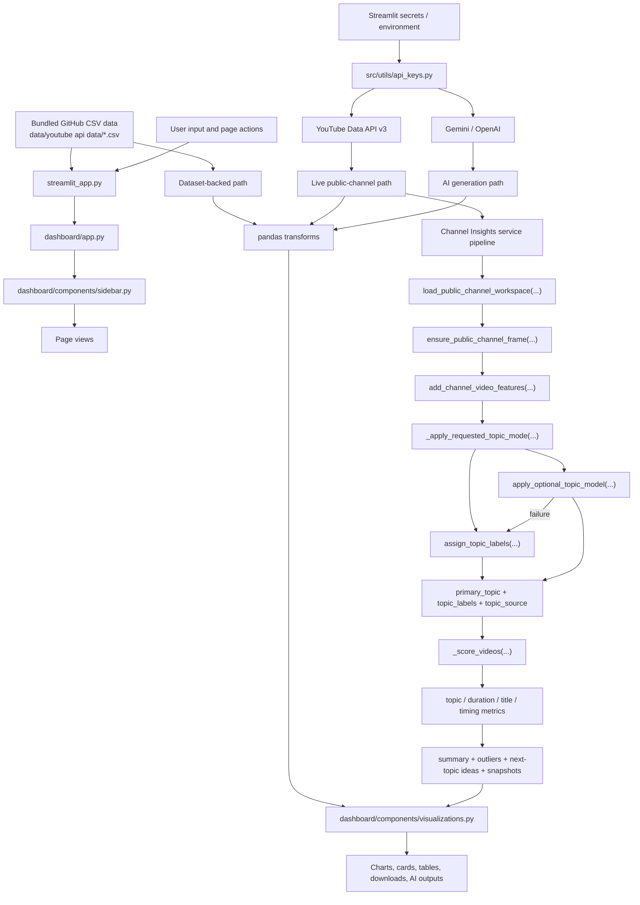
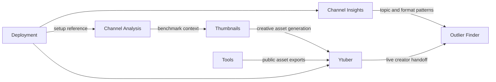
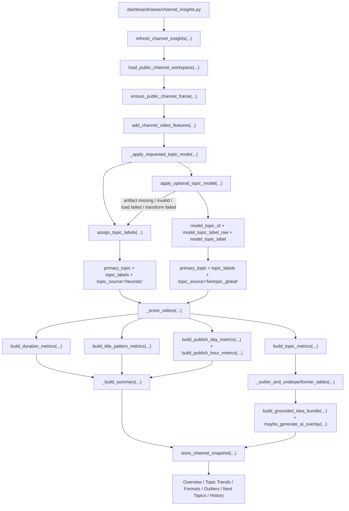
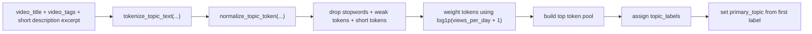
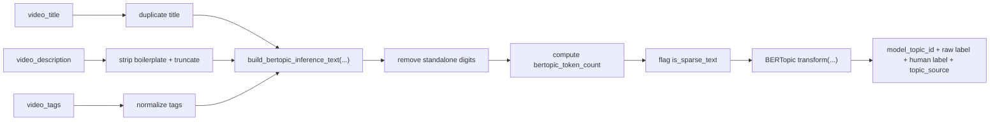
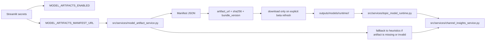
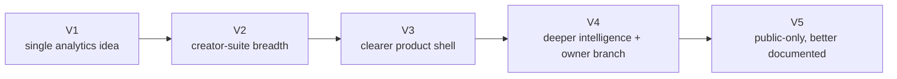

# YouTube IP V5 Architecture

This document explains how the current V5 app is wired, how it inherits ideas from earlier versions, and where the most important runtime logic now lives.

## Runtime Inventory

| Item | Count | Notes |
| --- | --- | --- |
| Streamlit entrypoints | `2` | `streamlit_app.py` and `dashboard/app.py` |
| Current sidebar destinations | `7` | `Channel Analysis`, `Channel Insights`, `Thumbnails`, `Outlier Finder`, `Ytuber`, `Tools`, `Deployment` |
| Primary data paths | `2` | bundled GitHub CSVs and live API-backed requests |
| Live provider families | `3` | `YouTube`, `Gemini`, `OpenAI` |
| Channel Insights topic modes | `2` | `Heuristic Topics` and `Model-Backed Topics (Beta)` |
| Topic-model artifact paths | `1` | optional BERTopic bundle loaded on demand |

## Sidebar Navigation

1. `Channel Analysis`
2. `Channel Insights`
3. `Thumbnails`
4. `Outlier Finder`
5. `Ytuber`
6. `Tools`
7. `Deployment`

V5 removes the sidebar `Assistant` and removes Google OAuth from `Channel Insights`, but keeps the broader AI suite pages.

## Full V5 Runtime And Data Pipeline

## Architecture Layers

| Layer | Main Files | Responsibility |
| --- | --- | --- |
| Entry and routing | `streamlit_app.py`, `dashboard/app.py` | boot Streamlit, set page config, route to page views |
| Navigation and shared UI | `dashboard/components/sidebar.py`, `dashboard/components/visualizations.py` | app chrome, navigation, reusable chart/table helpers |
| Dataset analytics | `dashboard/views/channel_analysis.py` | load committed CSVs and turn them into portfolio-level benchmarking views |
| Live public-channel and niche research | `dashboard/views/channel_insights.py`, `dashboard/views/outlier_finder.py`, `dashboard/views/ytuber.py`, `dashboard/views/tools.py` | coordinate live API-backed experiences |
| AI generation and modeling | `src/llm_integration/thumbnail_generator.py`, `src/services/channel_insights_service.py`, `src/services/topic_model_runtime.py` | generate creative assets, build insight payloads, run optional BERTopic inference |

## Page Problem Map

| Page | Problem Solved | Main Services / Inputs | Main UI Outputs | Cross-Version Context |
| --- | --- | --- | --- | --- |
| `Channel Analysis` | compare bundled datasets and benchmark channels at the portfolio level | CSVs in `data/youtube api data/`, pandas, visualization helpers | KPI cards, time-series charts, ranked tables | traces back to the earliest V1 analytics idea |
| `Channel Insights` | understand one tracked public channel over time | `public_channel_service`, `channel_snapshot_store`, `channel_insights_service`, optional BERTopic services | overview, topic trends, formats, outliers, next-topic ideas, history | the biggest new product idea introduced in V4 and retained in V5 |
| `Thumbnails` | keep thumbnail work focused and deployable | `thumbnail_generator.py`, thumbnail helper services, public thumbnail URLs | generated images, preview cards, downloads | replaces the broader `Recommendations` framing from V3/V4 |
| `Outlier Finder` | identify breakout videos in a niche | `outliers_finder.py`, `outlier_ai.py`, YouTube API | scored outlier tables, breakout summaries, AI research | matured from research logic into a durable product feature |
| `Ytuber` | provide a creator-focused live workspace | YouTube API, key-pool helpers, thumbnail generator | audits, AI Studio, planner and strategy outputs | carries forward the big V2 creator-suite expansion |
| `Tools` | inspect and export public YouTube assets | `youtube_tools.py`, `transcript_service.py`, `yt-dlp`, `ffmpeg` | metadata previews, transcripts, audio/video/thumbnail downloads | remains as a utility surface for advanced users |
| `Deployment` | explain how to run and deploy the app | app-shell instructions | repo, branch, secrets, deployment notes | a later addition to make deployment operationally clearer |

## How Pages Interlink

## Live API Extraction Flow

```mermaid
flowchart LR
    A["User enters channel, keyword, or URL"] --> B["Page view handler"]
    B --> C["src/utils/api_keys.py"]
    C --> D["Select or rotate provider key"]
    D --> E["YouTube Data API / Gemini / OpenAI request"]
    E --> F["Service-layer normalization"]
    F --> G["pandas frames or scored payloads"]
    G --> H["dashboard/components/visualizations.py"]
    H --> I["Rendered Streamlit UI"]
```

V5 is public-data-first. Unlike V4, `Channel Insights` no longer adds a Google OAuth branch for owner-only analytics.

## Channel Insights Topic Integration

The most important modeling branch in the current app lives inside `Channel Insights`. Both topic modes share the same public data workspace, the same feature engineering, the same scoring path, and the same downstream UI.

### Shared Refresh Path

1. `load_public_channel_workspace(...)`
2. `ensure_public_channel_frame(...)`
3. `add_channel_video_features(...)`
4. `_apply_requested_topic_mode(...)`

After step 4, both topic paths feed the same scoring, metrics, outlier detection, recommendation, and snapshot persistence layers.

### Topic Outputs That Persist

| Field | Meaning | Where It Gets Used |
| --- | --- | --- |
| `primary_topic` | row-level theme key | topic metrics, UI explanations, grouped tables |
| `topic_labels` | per-video topic label list | grouping, inspection, historical payloads |
| `topic_source` | whether a row came from heuristics or BERTopic beta | snapshot metadata and mode transparency |
| `topic_mode_requested` | mode selected by the user | snapshot summary JSON |
| `topic_mode_used` | actual mode used after fallback logic | snapshot summary JSON |
| `topic_model_bundle_version` | loaded artifact version when beta succeeds | snapshot summary JSON |
| `topic_model_failure_reason` | failure reason when beta falls back | snapshot summary JSON |

## Heuristic Vs Model-Backed Topics

| Topic Mode | Input Strategy | Availability | Strength | Constraint |
| --- | --- | --- | --- | --- |
| `Heuristic Topics` | tokenize title, tags, and description excerpt; normalize and weight tokens | always available | lightweight and deploy-safe | more literal grouping |
| `Model-Backed Topics (Beta)` | preprocess text for BERTopic semantic inference | only when explicitly requested and configured | better semantic grouping across phrasing variations | depends on external manifest and artifact bundle |

### Heuristic Topic Derivation

### BERTopic Beta Preprocessing

## Model-Backed Topic Artifact Flow

## Architecture Evolution Summary

| Version | Architectural Shift |
| --- | --- |
| `V1` | established the analytics + recommendation + BERTopic framing |
| `V2` | expanded into a wider creator operating system with many experimental modules |
| `V3` | clarified the runtime shell, page ownership, and active service layer |
| `V4` | added Channel Insights, the Assistant, Google OAuth, and the BERTopic beta runtime |
| `V5` | kept Channel Insights and BERTopic beta, removed Assistant and OAuth, and documented the system for presentation and deployment clarity |
