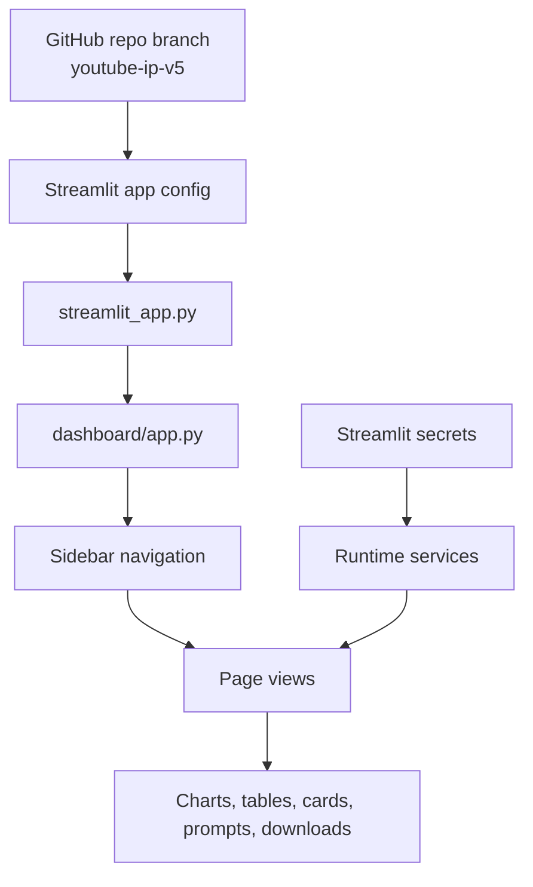
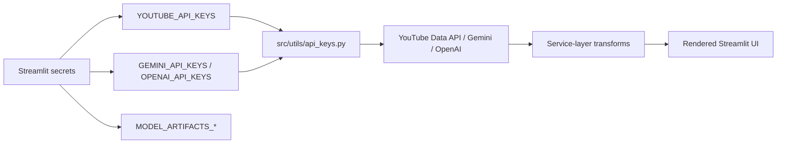
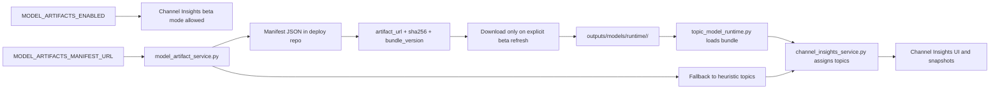

# V5 Deployment, Versions, And Model Flow

## Branch And Repo Targets

| Item | Value |
| --- | --- |
| Original repo branch tag | `youtube-ip-v5` |
| Original repo | `matt-foor/purdue-youtube-ip` |
| Deploy repo | `royayushkr/Youtube-IP-V5` |
| Deploy branch | `main` |
| PR branch reference | [youtube-ip-v5](https://github.com/matt-foor/purdue-youtube-ip/tree/youtube-ip-v5) |

## Navigation Order

1. `Channel Analysis`
2. `Channel Insights`
3. `Thumbnails`
4. `Outlier Finder`
5. `Ytuber`
6. `Tools`
7. `Deployment`

## Streamlit Deployment Flow



## Secrets And Live API Flow



In V5, `Channel Insights` is public-only and does not use Google OAuth.

## Model-Backed Topic Deployment



### Topic Mode Explanation

- `Heuristic Topics` = built-in keyword and rule grouping
- `Model-Backed Topics` = optional BERTopic semantic grouping loaded from the external artifact path

### Streamlit Secrets Block

```toml
YOUTUBE_API_KEYS = ["your_youtube_key_1", "your_youtube_key_2"]
GEMINI_API_KEYS = ["your_gemini_key_1", "your_gemini_key_2"]
OPENAI_API_KEYS = ["your_openai_key_1", "your_openai_key_2"]

MODEL_ARTIFACTS_ENABLED = true
MODEL_ARTIFACTS_MANIFEST_URL = "https://raw.githubusercontent.com/royayushkr/Youtube-IP-V5/main/data/model_manifests/bertopic_manifest_2026.03.27.json"
MODEL_ARTIFACTS_CACHE_DIR = "outputs/models/runtime"
MODEL_ARTIFACTS_DOWNLOAD_TIMEOUT_SECONDS = 300
MODEL_ARTIFACTS_MAX_SIZE_MB = 512
```

## V4 Vs V5

| Area | V4 (`youtube-ip-v4`) | V5 (`youtube-ip-v5`) |
| --- | --- | --- |
| Sidebar Assistant | Present | Removed |
| Google OAuth | Present | Removed |
| Channel Insights | Public + optional owner overlays | Public-only |
| Page 3 label | `Recommendations` | `Thumbnails` |
| Ytuber | Present | Present |
| Tools | Present | Present |
| Deployment | Present | Present |
| BERTopic beta | Optional | Optional |
