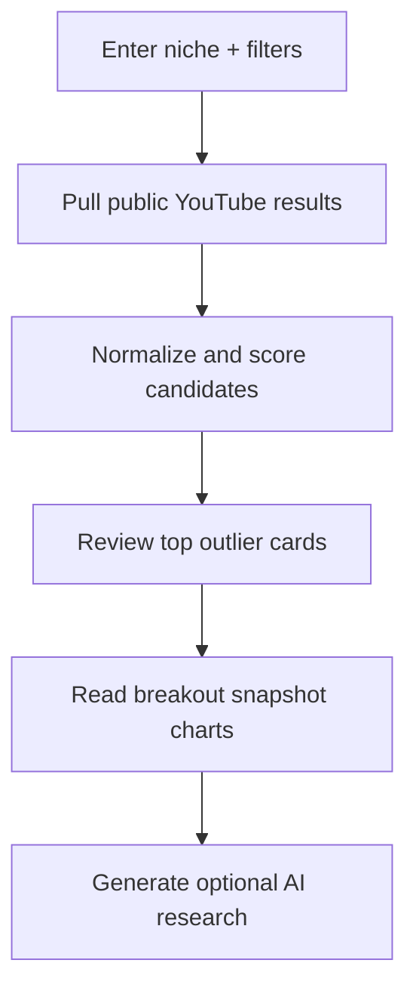

# Outlier Finder Presentation Notes

This is the presentation-friendly version of the Outlier Finder explanation. For the deeper technical walkthrough, formulas, and implementation detail, use [Architecture](ARCHITECTURE.md#outlier-finder).

## One-Sentence Summary

Outlier Finder scans a public YouTube niche, builds a filtered cohort of videos, scores which uploads are outperforming expectations for their age and channel context, and then optionally lets AI explain the visible patterns.

## The Core Story To Tell

If you are presenting the page, the cleanest framing is:

1. we start with a niche query, not a creator account
2. we collect public YouTube evidence
3. we score videos with transparent performance heuristics
4. we visualize the winners before interpreting them
5. only after that do we hand the results to AI for research support

That sequence matters because the page is meant to be evidence-first and AI-second.

## Demo Flow

## What Problem The Page Solves

The page helps answer:

- which videos in this niche are breaking out right now?
- are they outperforming because of channel size alone, or because they are genuinely strong relative to comparable videos?
- what packaging, runtime, and topical patterns repeat across the winners?

## How To Explain The Score

The simplest explanation is:

- the outlier score is a 0-100 heuristic
- it blends four ideas:
  - velocity
  - engagement
  - peer-relative strength
  - channel-relative lift when baseline data exists

In plain language:

- if a video is getting views quickly for its age
- and it is doing well relative to similar channels
- and it is beating what that channel usually does
- then the score rises

## The Four Most Important Metrics

| Metric | Plain-language explanation |
| --- | --- |
| `Views / Day` | how fast the video is accumulating views right now |
| `Engagement Rate` | how much public interaction the video is generating per view |
| `Peer Percentile` | how strong the video looks versus similar-age, similar-size videos in the scanned cohort |
| `Baseline Lift` | how much the video is beating that channel’s own recent median performance |

## How To Explain Each Main Section

### Top Outliers In This Scan

What to say:

- this is the winner set
- each card shows the score, raw scale, daily velocity, and a short explanation of why the result stands out
- the table below lets us inspect the full ranked cohort, not just the prettiest examples

### Breakout Snapshot

What to say:

- this section turns the scanned niche into a pattern read
- it shows not just which videos won, but how the niche is winning overall

#### Breakout Map

What to say:

- this chart compares daily velocity against channel size
- if a smaller or medium-sized channel is high on the chart, that is usually more interesting than a large channel doing what large channels usually do

#### Outlier Score By Publish Age

What to say:

- this tells us whether the niche is being driven by very fresh uploads or by videos that are proving durable over time

#### Winning Video Lengths

What to say:

- this shows whether short, medium, or longer formats are disproportionately present in the strongest results

#### Repeated Title Structures

What to say:

- this gives us packaging clues
- it helps us see if the winners cluster around `How / Why`, numbered titles, explainers, challenge framing, and similar structures

#### Scan Quality

What to say:

- this is the reliability check before using AI
- high language match and strong-signal share usually mean cleaner research
- high hidden-subscriber share means we should be more cautious about channel-size comparisons

### AI Research

What to say:

- the AI layer is not generating the outlier score
- it is reading the already-scored evidence and turning it into theme cards, angle suggestions, title observations, and next-step tests

That distinction is important in a presentation because it makes the tool feel grounded rather than speculative.

## Short Talk Track For The Math

If someone asks how the score is calculated, a good short answer is:

- first the app measures raw public performance like views per day and engagement
- then it compares the video to a peer group of videos with similar age and rough channel size
- then, for the strongest channels in the scan, it also compares each candidate against that channel’s own recent median performance
- those pieces are blended into a single 0-100 score

## What Makes The Page Useful

- it is fast enough for topic research
- it uses public data, so it works without creator login
- it is transparent enough to explain in a classroom or stakeholder presentation
- it separates evidence gathering from AI interpretation

## Honest Caveats To Mention

- it does not have impressions, CTR, watch time, or retention
- YouTube search results are sampled and ranked, not exhaustive
- subscriber counts can be hidden
- language filtering is heuristic
- the score is a research signal, not a guaranteed prediction

## Best Final Framing

If you want one closing line for a presentation:

- Outlier Finder helps us move from “interesting niche results” to “ranked breakout evidence plus repeatable creative patterns” using only public YouTube data.
