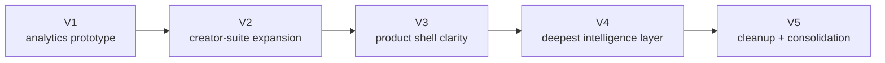

# YouTube IP Project Brief And Retrospective

This document combines the original project brief with a retrospective look at how the product evolved from V1 through V5.

## Original Problem Statement

The project started from a practical creator problem: many small-to-mid-tier YouTube creators can see their own channel analytics, but they often lack cross-channel intelligence, comparable trend context, and actionable recommendations for what to make next. The team set out to close that gap by combining public YouTube data, modeling, and AI-assisted strategy generation in a usable dashboard.

## Original Goal

The original V1 ambition was to design a solution that could:

- analyze trends across many YouTube channels
- identify patterns linked to stronger performance
- turn public metadata into creator-focused strategy guidance
- recommend future topics, titles, thumbnails, and posting patterns
- deliver the results through an interactive Streamlit app

## Original Technical Direction

The initial stack direction, which stayed influential through every version, was:

- Python for collection, processing, and modeling
- YouTube Data API v3 for public metadata
- BERTopic for semantic topic modeling
- LLMs for recommendation and ideation layers
- Streamlit for delivery

## What The Team Ultimately Built

| Metric | Value |
| --- | --- |
| Documented deployed versions | `5` |
| Live deployed Streamlit apps | `5` |
| Current V5 sidebar pages | `7` |
| Stable primary data paths in V5 | `2` |
| Current Channel Insights topic modes | `2` |

## Product Journey Across Versions

### V1: Analytics Prototype

V1 established the basic thesis:

- public metadata could support creator strategy
- BERTopic and NLP could help cluster content themes
- a Streamlit dashboard could present results in a useful way

V1 contributed the strongest early framing for:

- why creators need cross-channel intelligence
- how data collection, processing, modeling, and recommendation fit together
- the importance of explainability and responsible use of public data

### V2: Creator-Suite Expansion

V2 pushed the project much further toward a creator operating system:

- broader app shell
- larger Ytuber workflow
- more AI generation paths
- stronger deployment practicality
- more “do work in one place” product ambition

This version was valuable because it let the team test more end-user workflows quickly. It also exposed the cost of breadth: more surface area, more overlap, and more documentation drift.

### V3: Productization

V3 made the app easier to understand:

- clearer multi-page shell
- stronger runtime architecture explanation
- explicit page ownership
- stronger outlier workflow
- better documentation of active versus historical code

This version was where the project started to feel like a defined product instead of a bundle of experiments.

### V4: Deepest Intelligence Phase

V4 was the most ambitious release. It added:

- `Channel Insights`
- sidebar `Assistant`
- Google OAuth
- owner-only analytics overlays
- optional BERTopic runtime inside the deployed app
- deeper tracked-channel snapshots and recommendations

It proved that the product could move beyond static benchmarking and into ongoing tracked-channel intelligence. It also revealed the cost of that depth:

- more secrets
- more branching logic
- more deployment risk
- more explanation burden for users

### V5: Cleanup And Consolidation

V5 keeps the best-performing ideas and removes some of the heaviest operational complexity.

V5 intentionally:

- removes the sidebar `Assistant`
- removes Google OAuth and owner-only analytics
- keeps `Channel Insights`, but makes it public-only
- keeps `Ytuber`, `Tools`, and `Deployment`
- renames page 3 to `Thumbnails`
- keeps optional BERTopic beta modeling as a guarded, explicit path
- improves documentation so the project can be presented clearly end to end

## What We Tried, Learned, And Changed

| Theme | What We Tried | What We Learned | What V5 Keeps |
| --- | --- | --- | --- |
| Cross-channel analytics | benchmarking with committed CSV datasets | this remained valuable in every version | `Channel Analysis` |
| Creator suite breadth | larger all-in-one workflow surfaces in V2 | breadth is useful, but only if the surface stays understandable | `Ytuber`, `Tools`, `Deployment` remain, but the shell is clearer |
| Mixed recommendations page | blending dataset guidance with creative tooling | this created overlap with analysis pages | V5 narrows page 3 to `Thumbnails` |
| Deep tracked-channel intelligence | `Channel Insights` with snapshots and structured metrics | this was one of the strongest additions in the whole project | public-only `Channel Insights` remains central |
| Owner-only analytics | Google OAuth plus private metrics | valuable, but raised deployment and maintenance overhead | removed in V5 |
| Global helper UI | sidebar `Assistant` | useful in concept, but expensive in complexity versus direct page docs | removed in V5 |
| Optional modeling in production | BERTopic beta via external artifact flow | feasible if it stays optional and lazy-loaded | retained in V5 |

## What Was Removed Or Simplified And Why

| Capability | Why It Was Added Originally | Why It Was Reduced Later |
| --- | --- | --- |
| Sidebar `Assistant` | give users a global help layer across pages | duplicated explanation work that stronger docs and page-focused UX could handle more simply |
| Google OAuth / owner analytics | unlock private creator metrics in `Channel Insights` | required more secrets, more branching, and more deployment overhead than the V5 public-only posture wanted |
| Broader `Recommendations` framing | combine strategy guidance with creative tooling | too much overlap with `Channel Analysis` and `Channel Insights`; V5 makes the page purpose narrower |
| Ever-expanding creator-suite surface | explore many ideas quickly during product growth | made the product harder to explain cleanly to new readers and evaluators |

## What Stayed True From Start To Finish

Across all versions, the project kept returning to the same durable principles:

- use public data to produce strategy, not just description
- combine quantitative signals with explainable modeling
- use AI as an accelerator, not as a black box replacement for analysis
- package the work in a way creators can actually use
- keep Streamlit as the fastest path to an interactive intelligence product

## Current V5 Position

V5 is the clearest version to present because it balances ambition with deployability:

- it still shows the full scope of the project
- it keeps the strongest live workflows
- it preserves the modeling story
- it retains the AI suite pages
- it removes the heaviest operational branching from V4
- it explains the complete journey from prototype to current product

## Presentation-Ready Summary

If this repo is being used for a final presentation, the cleanest narrative is:

1. We started with a public-data analytics prototype.
2. We expanded into a broad creator operating system to explore the space.
3. We productized the workflows into clearer pages and better runtime structure.
4. We pushed deepest in V4 with tracked-channel intelligence, private analytics, and optional BERTopic runtime.
5. We consolidated into V5 so the final story is easier to deploy, easier to explain, and still representative of the most valuable work.

## Live Deployment Timeline

| Version | Live App |
| --- | --- |
| `V1` | [youtube-stats-ip.streamlit.app](https://youtube-stats-ip.streamlit.app/) |
| `V2` | [youtube-stats-ip-v2.streamlit.app](https://youtube-stats-ip-v2.streamlit.app/) |
| `V3` | [youtube-ip-v3.streamlit.app](https://youtube-ip-v3.streamlit.app/) |
| `V4` | [youtube-ip-v4.streamlit.app](https://youtube-ip-v4.streamlit.app/) |
| `V5` | [youtube-ip-v5.streamlit.app](https://youtube-ip-v5.streamlit.app/) |

## Where To Go Next

- [README](../README.md) for the cross-version presentation overview
- [Architecture](ARCHITECTURE.md) for runtime, data, and topic-model flowcharts
- [Deployment And Versions](DEPLOYMENT_AND_VERSIONS.md) for secrets, deploy targets, and version-by-version comparisons
